<a id="readme-top"></a>

<div align="center">
  <a href="docs/screenshots/inicio-escuro-1.png">
    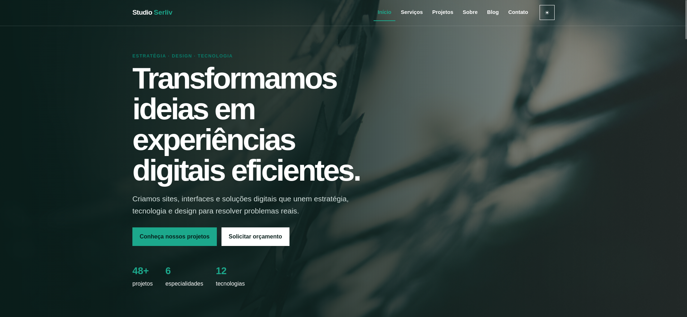
  </a>

  <h1>Studio Serliv</h1>

  <p>
    Site institucional fictício de uma agência digital especializada em sites,
    sistemas web, interfaces, automações e otimização de experiências digitais.
  </p>

  <p>
    
    
    
  </p>

  <p>
    <a href="https://auhauhbr.github.io/serliv-studio/">
      
    </a>
  </p>

  <p>
    <a href="https://jeffersontadeu.vercel.app">
      
    </a>
    <a href="https://github.com/auhauhbr">
      
    </a>
    <a href="https://www.linkedin.com/in/jefferson-tadeu-dos-santos-0ab133380">
      
    </a>
  </p>

  <p>
    
    
    
    
  </p>
</div>

## Sobre o projeto

Studio Serliv é um projeto front-end multipágina criado com HTML5, CSS3 e
JavaScript puro. O site apresenta uma agência digital fictícia com identidade
corporativa, conteúdo autoral, portfólio, estudos de caso, blog, serviços,
equipe, formulário de contato e simulador de orçamento.

A aplicação não depende de build, framework, API externa ou servidor. Os dados
de projetos e artigos possuem arquivos JSON locais e fallback em JavaScript,
permitindo abrir o projeto diretamente pelo `index.html`.

A direção visual utiliza tons neutros, verde-turquesa, grids organizados,
componentes retos e dois temas persistentes: claro e escuro.

## Origem e evolução do projeto

O Studio Serliv nasceu como um aperfeiçoamento do projeto apresentado na
**Sessão 59 — [LEGADO] Projeto final** do curso
[Programação Web Front-end Fundamentos: HTML, CSS, Lógica de programação e JavaScript](https://www.udemy.com/course/curso-web-design-fundamentos-aprenda-html-css-e-javascript/?srsltid=AfmBOoqRS0z4tpcdAAn40ApzWFaf6Rr8R48U3sPzCfivM1sYf-LLPufS),
com carga horária total de **132,5 horas**.

O layout original foi utilizado como ponto de partida para praticar e consolidar
os fundamentos estudados. A partir dele, o projeto foi reestruturado e ampliado
para se aproximar de um produto comercial completo: ganhou identidade autoral,
novas páginas, conteúdo contextualizado, responsividade, acessibilidade, temas
claro e escuro e funcionalidades desenvolvidas exclusivamente com JavaScript
puro.

Esta versão não é apenas uma reprodução do exercício do curso. Ela representa
uma evolução prática do aprendizado, preservando a referência histórica do
projeto original enquanto demonstra decisões próprias de arquitetura,
interface, experiência do usuário e organização de código.

## Principais recursos

- oito páginas HTML conectadas por navegação real;
- layout responsivo para celulares, tablets, notebooks e monitores grandes;
- tema claro como padrão e tema escuro persistido entre páginas;
- menu mobile com navegação por teclado;
- cabeçalho fixo e indicação da página ativa;
- projetos carregados por JSON com fallback para `file://`;
- pesquisa, filtros, ordenação e carregamento progressivo do portfólio;
- estudos de caso carregados por parâmetro na URL;
- modal acessível com bloqueio de rolagem e controle de foco;
- blog com pesquisa, categorias, artigos dinâmicos e estado vazio;
- sumário lateral e barra de progresso de leitura;
- carrossel de depoimentos com pausa, indicadores e navegação por teclado;
- contadores e animações com `IntersectionObserver`;
- acordeão de perguntas frequentes;
- formulário com validação acessível e notificações personalizadas;
- simulador de orçamento totalmente front-end;
- respeito a `prefers-reduced-motion`;
- imagens e dados mantidos localmente.

## Capturas de tela

As comparações abaixo apresentam os temas claro e escuro lado a lado. Clique em
qualquer captura para abrir a imagem original.

### Página inicial — primeira parte

<table>
  <tr><th width="50%">Tema claro</th><th width="50%">Tema escuro</th></tr>
  <tr>
    <td><a href="docs/screenshots/inicio-claro-1.png">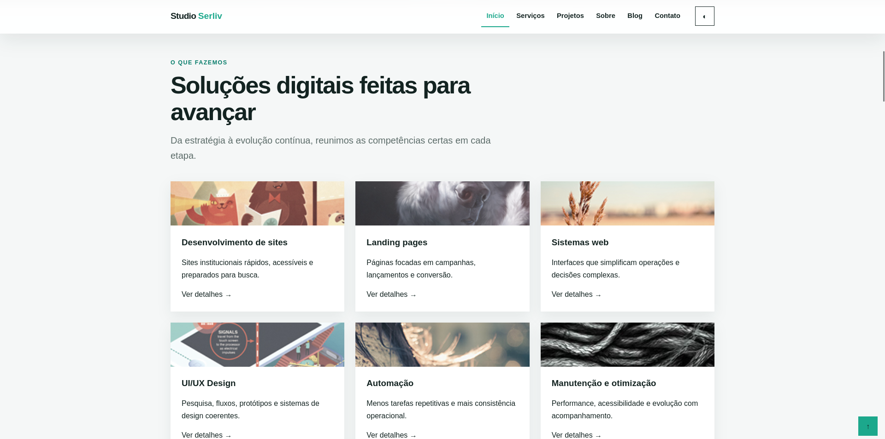</a></td>
    <td><a href="docs/screenshots/inicio-escuro-1.png"></a></td>
  </tr>
</table>

### Página inicial — conteúdo complementar

<table>
  <tr><th width="50%">Tema claro</th><th width="50%">Tema escuro</th></tr>
  <tr>
    <td><a href="docs/screenshots/inicio-claro-2.png">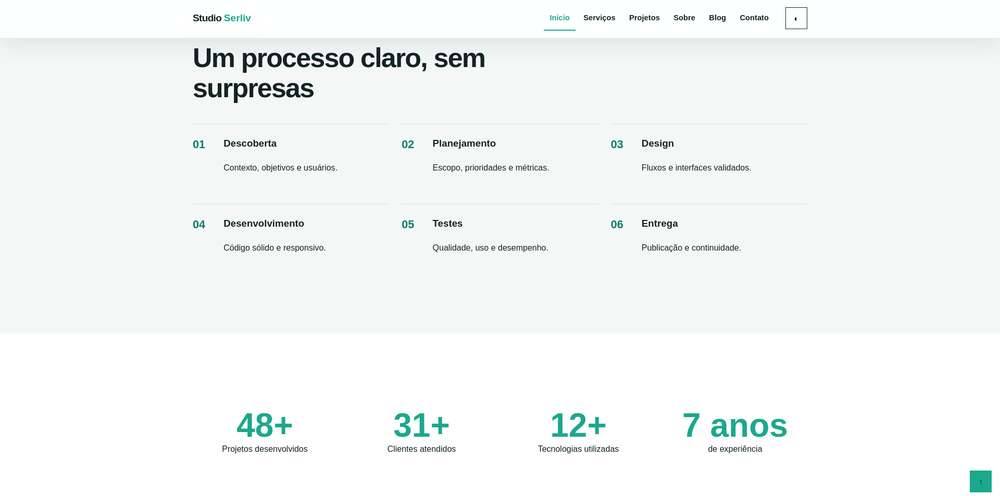</a></td>
    <td><a href="docs/screenshots/inicio-escuro-2.png">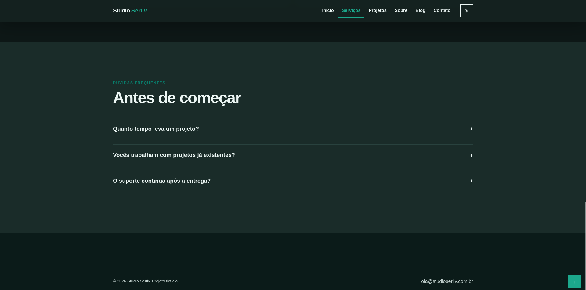</a></td>
  </tr>
</table>

### Serviços

<table>
  <tr><th width="50%">Tema claro</th><th width="50%">Tema escuro</th></tr>
  <tr>
    <td><a href="docs/screenshots/servicos-claro.png">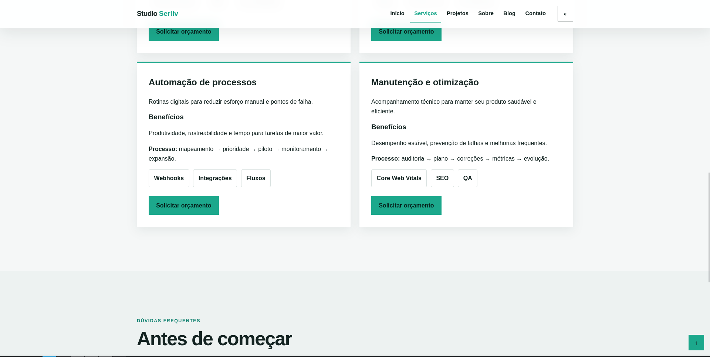</a></td>
    <td><a href="docs/screenshots/servicos-escuro.png">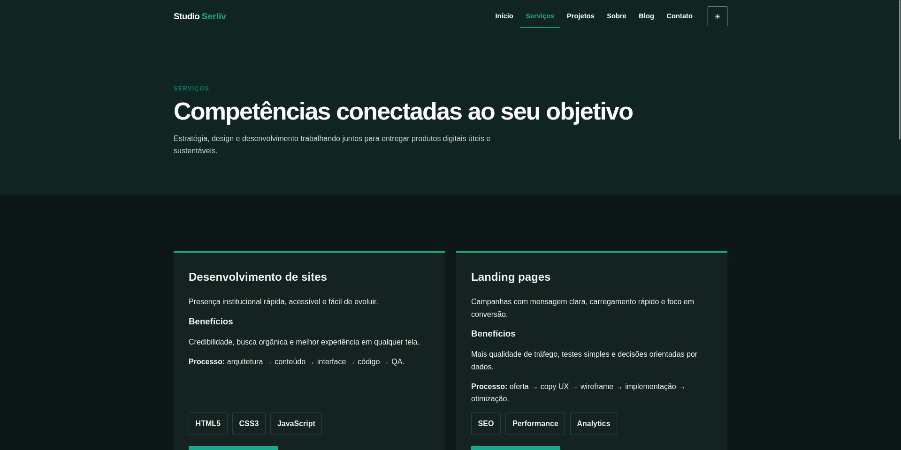</a></td>
  </tr>
</table>

### Sobre — história e princípios

<table>
  <tr><th width="50%">Tema claro</th><th width="50%">Tema escuro</th></tr>
  <tr>
    <td><a href="docs/screenshots/sobre-claro-1.png">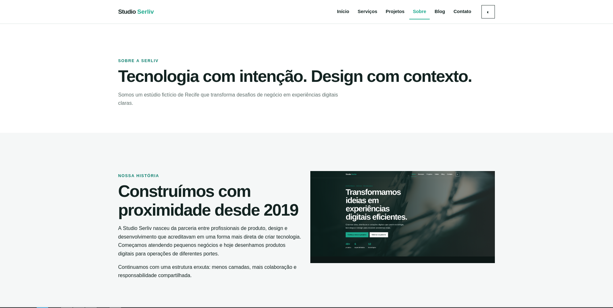</a></td>
    <td><a href="docs/screenshots/sobre-escuro-1.png"></a></td>
  </tr>
</table>

### Sobre — equipe e trajetória

<table>
  <tr><th width="50%">Tema claro</th><th width="50%">Tema escuro</th></tr>
  <tr>
    <td><a href="docs/screenshots/sobre-claro-2.png">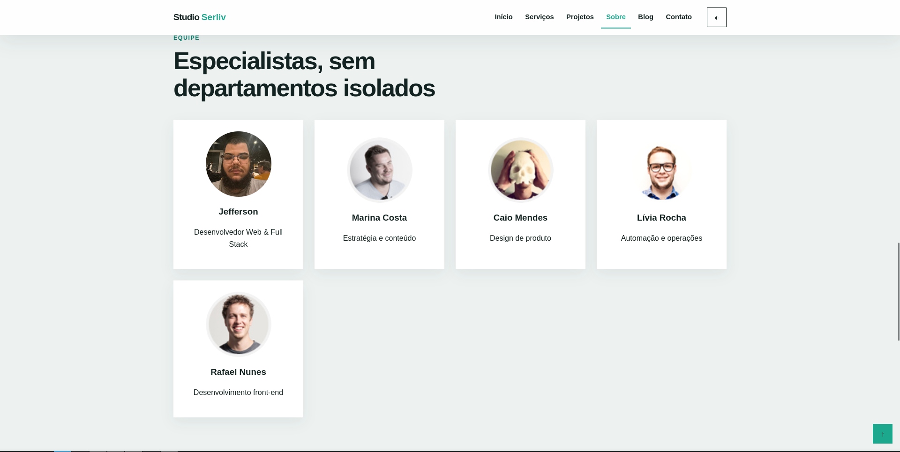</a></td>
    <td><a href="docs/screenshots/sobre-escuro-2.png">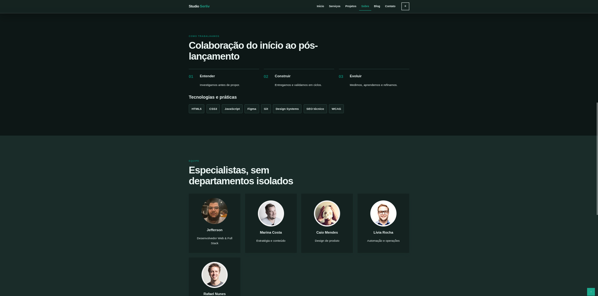</a></td>
  </tr>
</table>

### Contato e orçamento

<table>
  <tr><th width="50%">Tema claro</th><th width="50%">Tema escuro</th></tr>
  <tr>
    <td><a href="docs/screenshots/contato-claro.png">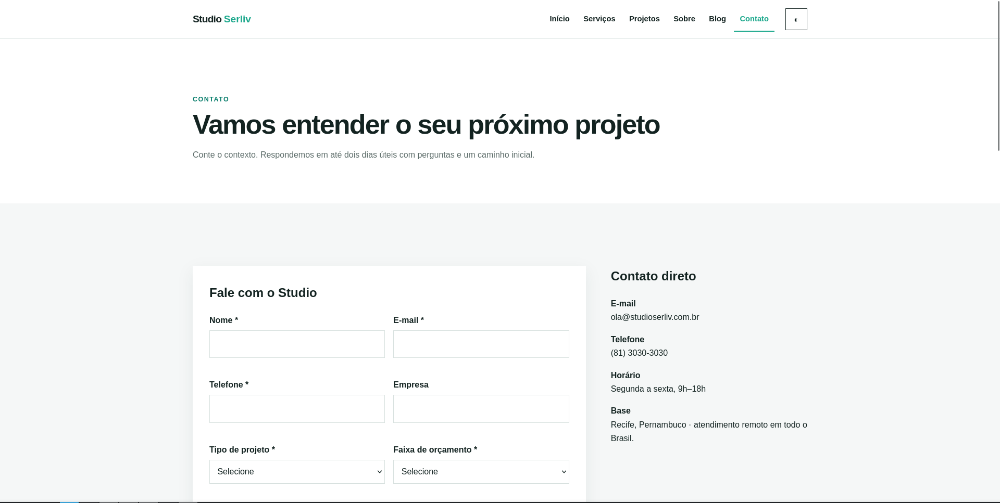</a></td>
    <td><a href="docs/screenshots/contato-escuro.png">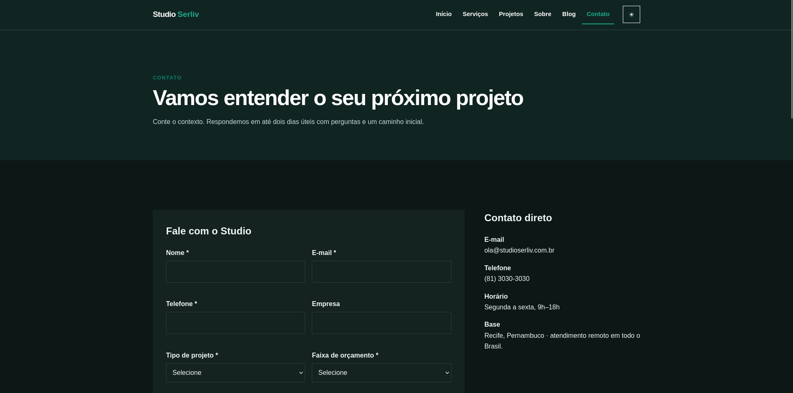</a></td>
  </tr>
</table>

### Portfólio e blog

<table>
  <tr><th width="50%">Projetos — tema claro</th><th width="50%">Blog — tema escuro</th></tr>
  <tr>
    <td><a href="docs/screenshots/projetos-claro.png">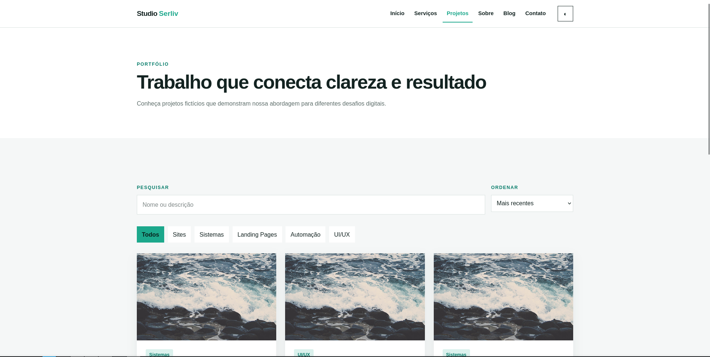</a></td>
    <td><a href="docs/screenshots/blog-escuro-1.png">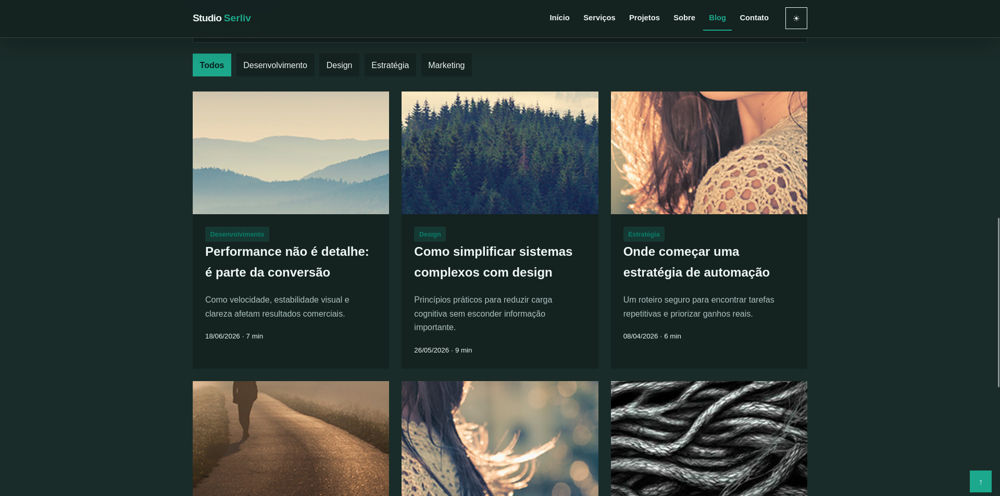</a></td>
  </tr>
  <tr>
    <td></td>
    <td><a href="docs/screenshots/blog-escuro-2.png">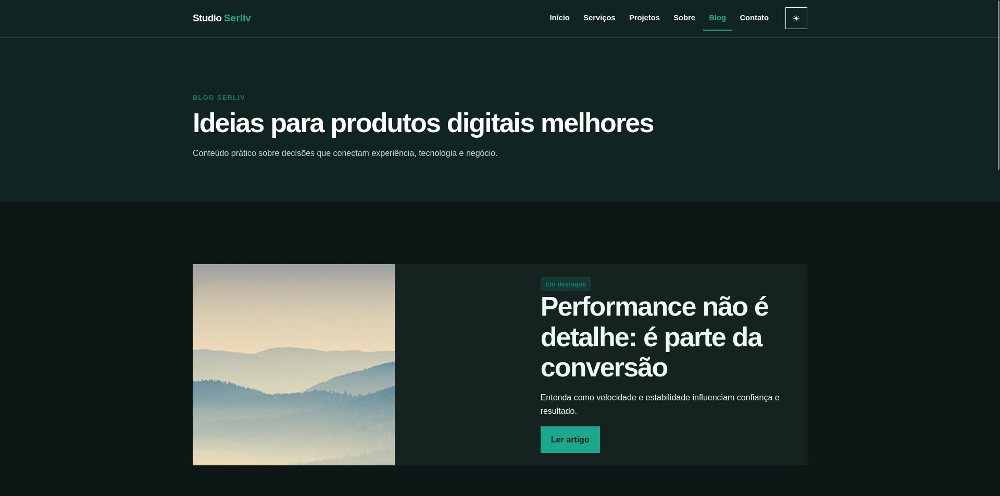</a></td>
  </tr>
</table>

## Arquitetura

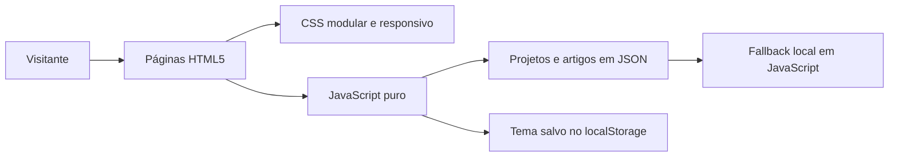

Cada página carrega apenas os módulos JavaScript necessários ao seu contexto. A
camada comum controla navegação, tema, rolagem, animações e notificações. Os
módulos de projetos e blog consomem JSON quando disponível e recorrem aos dados
embutidos caso o navegador bloqueie `fetch` em `file://`.

## Tecnologias utilizadas

| Tecnologia | Onde foi utilizada |
|---|---|
| [![HTML5][html-badge]][html-url] | Estrutura semântica das páginas, formulários, artigos, navegação e componentes acessíveis |
| [![CSS3][css-badge]][css-url] | Design tokens, temas, Grid, Flexbox, responsividade, transições e estados visuais |
| [![JavaScript][javascript-badge]][javascript-url] | Filtros, modais, tema, carrosséis, formulários, orçamento e conteúdo dinâmico |
| [![JSON][json-badge]][json-url] | Dados locais dos projetos e artigos |

## Estrutura principal

```text
serliv-studio/
├── index.html
├── pages/
│   ├── artigo.html
│   ├── blog.html
│   ├── contato.html
│   ├── projeto.html
│   ├── projetos.html
│   ├── servicos.html
│   └── sobre.html
├── css/
│   ├── normalize.css
│   ├── global.css
│   ├── componentes.css
│   ├── paginas.css
│   ├── responsivo.css
│   └── ajustes.css
├── js/
│   ├── principal.js
│   ├── menu.js
│   ├── tema.js
│   ├── slider.js
│   ├── projetos.js
│   ├── blog.js
│   ├── formulario.js
│   └── orcamento.js
├── dados/
│   ├── projetos.json
│   └── artigos.json
├── assets/
│   └── imagens/
└── docs/
    └── screenshots/
```

## Como executar

O projeto não possui dependências ou etapa de compilação.

### Abrindo diretamente

Abra `index.html` no navegador. Os fallbacks locais mantêm projetos e artigos
disponíveis mesmo quando o navegador bloqueia os arquivos JSON.

### Utilizando Live Server

Abra a pasta `serliv-studio` no editor e execute o `index.html` com uma extensão
como Live Server.

Também é possível iniciar um servidor local simples:

```bash
python3 -m http.server 8000 --directory serliv-studio
```

Depois acesse:

```text
http://127.0.0.1:8000
```

## Deploy

O projeto é publicado automaticamente no GitHub Pages a cada atualização da
branch `main`:

**[auhauhbr.github.io/serliv-studio](https://auhauhbr.github.io/serliv-studio/)**

Como todos os recursos usam caminhos relativos, a aplicação funciona dentro do
subdiretório `/serliv-studio/`, inclusive nas páginas internas e no carregamento
dos arquivos JSON locais.

## Acessibilidade

- link para pular diretamente ao conteúdo;
- foco visível em controles interativos;
- labels associados aos campos;
- mensagens de erro acessíveis;
- atributos ARIA em menu, acordeões e modal;
- fechamento do modal com `Escape`;
- contenção de foco durante a abertura do modal;
- navegação por teclado nos carrosséis;
- contraste adequado nos dois temas;
- suporte a preferência por redução de movimento.

## Contato

- Portfólio: [jeffersontadeu.vercel.app](https://jeffersontadeu.vercel.app)
- GitHub: [github.com/auhauhbr](https://github.com/auhauhbr)
- LinkedIn: [Jefferson Tadeu dos Santos](https://www.linkedin.com/in/jefferson-tadeu-dos-santos-0ab133380)
- E-mail: [tadeu.santos7148@gmail.com](mailto:tadeu.santos7148@gmail.com)

<p align="right">(<a href="#readme-top">voltar ao topo</a>)</p>

[html-badge]: https://img.shields.io/badge/HTML5-E34F26?style=for-the-badge&logo=html5&logoColor=white
[html-url]: https://developer.mozilla.org/pt-BR/docs/Web/HTML
[css-badge]: https://img.shields.io/badge/CSS3-1572B6?style=for-the-badge&logo=css3&logoColor=white
[css-url]: https://developer.mozilla.org/pt-BR/docs/Web/CSS
[javascript-badge]: https://img.shields.io/badge/JavaScript-F7DF1E?style=for-the-badge&logo=javascript&logoColor=111
[javascript-url]: https://developer.mozilla.org/pt-BR/docs/Web/JavaScript
[json-badge]: https://img.shields.io/badge/JSON-5C6C69?style=for-the-badge&logo=json&logoColor=white
[json-url]: https://www.json.org/json-pt.html
